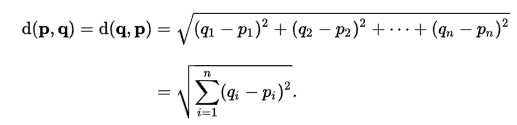

# knn学习
## 一、初始knn
k近邻法(k-nearest neighbor, k-NN)是1967年由Cover T和Hart P提出的一种基本分类与回归方法。

它的工作原理是：存在一个样本数据集合，也称作为训练样本集，并且样本集中每个数据都存在标签，即我们知道样本集中每一个数据与所属分类的对应关系。

一般来说，我们只选择样本数据集中前k个最相似的数据，这就是k-近邻算法中k的出处，通常k是不大于20的整数。

最后，选择k个最相似数据中出现次数最多的分类，作为新数据的分类。

## 二、knn的距离度量
以特征数据量为维度的欧式距离:  

 

即：假设特征数据量n=2，则距离为一下公式：   

 
  
knn算法步骤如下：
<ol>
    <li>计算已知类别数据集中的点与当前点之间的距离；</li>
    <li>按照距离递增次序排序；</li>
    <li>选取与当前点距离最小的k个点；</li>
    <li>确定前k个点所在类别的出现频率；</li>
    <li>返回前k个点所出现频率最高的类别作为当前点的预测分类。</li>
</ol> 

### eg:爱情/动作片:
 
  
  
编程实现“爱情/动作片”: 
详情见文件：./codes/film_1.py 和 ./codes/film_2.py